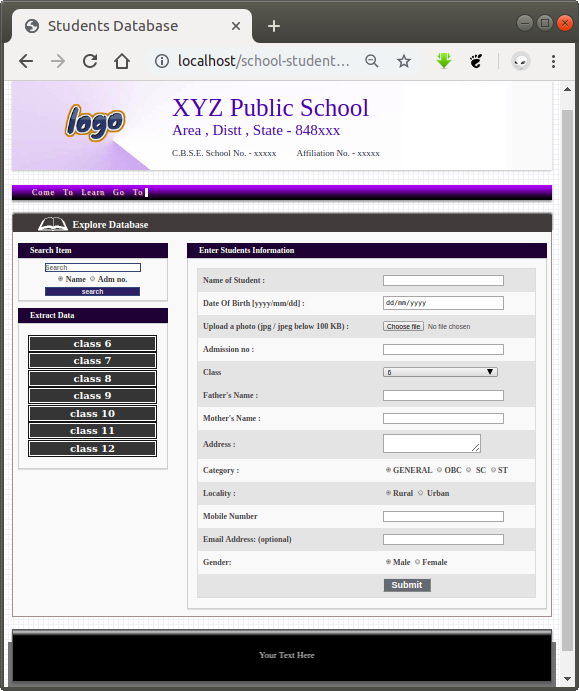
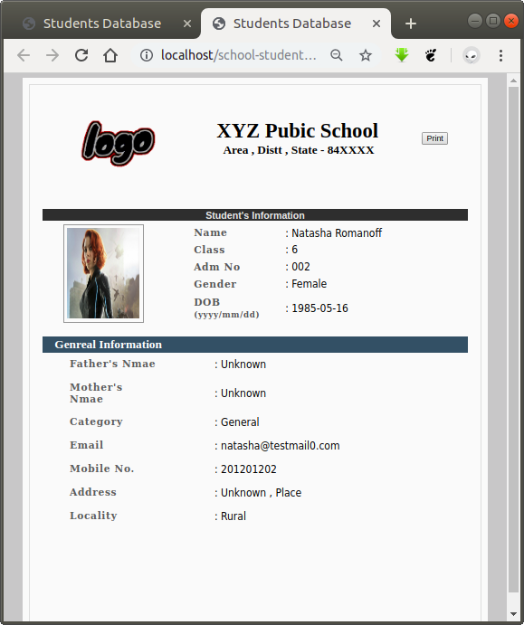

## This web application made with *PHP* to store information of students of Class 6 to Class 12 in *MYSQL* Database 

  ---

  1. Import SQL_Students_db.sql to phpmyadmin From SQL_File folder .

  1. Copy Web_Files into http folder .

  1. Now Everything Is Ready , just open url of this Web App in browser
  

 ---

 ## Interface Demo :

  
  
  

**I created this Web Application during my School now this is open Source**
